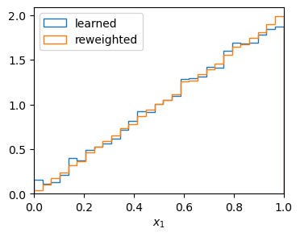

First steps
===========

This tutorial demonstrates how MadNIS can be used to integrate functions. As an example, we will use
the function

.. math::
    f(x) = \prod_{i=1}^d 2 x_i \; .

It's integral over the unit hypercube :math:`[0,1]^d` is always :math:`1`, independent of the number
of dimensions :math:`d`.

Minimal example
---------------

Let's compute the integral in four dimensions. This can be done with the following code

.. code-block:: python

    from madnis.integrator import Integrator
    integrator = Integrator(lambda x: (2*x).prod(dim=1), dims=4)
    integrator.train(100)
    result, error = integrator.integral()
    print(f"Integration result: {result:.5f} +- {error:.5f}")

We first create an :py:class:`Integrator <madnis.integrator.Integrator>` object with our integrand and its dimension. Then we have to train the
integrator for 100 iterations. Lastly, we use combine the information over the
integral collected during the training and print the integral and the Monte Carlo integration error
in the last line. We get the output::

    Integration result: 1.00382 +- 0.00129

Monitoring the training progress
--------------------------------

To better monitor the training progress, we can also specify a callback function that is called with
a TrainingStatus object after every tenth iteration.

.. code-block:: python

    integrator = Integrator(lambda x: (2*x).prod(dim=1), dims=4)
    def callback(status):
        if (status.step + 1) % 10 == 0:
            print(f"Batch {status.step + 1}: loss={status.loss:.5f}")
    integrator.train(100, callback)
    result, error = integrator.integral()
    print(f"Integration result: {result:.5f} +- {error:.5f}")

The output is

.. code-block:: text

    Batch 10: loss=0.51366
    Batch 20: loss=0.23448
    Batch 30: loss=0.13336
    Batch 40: loss=0.08787
    Batch 50: loss=0.05898
    Batch 60: loss=0.03766
    Batch 70: loss=0.03791
    Batch 80: loss=0.02405
    Batch 90: loss=0.02370
    Batch 100: loss=0.01639
    Integration result: 1.00335 +- 0.00127

Computing the integral with more statistics
-------------------------------------------

If we don't just want to use the samples collected during the training to compute the integral, but
draw additional samples using our trained flow, we can also use the
:py:meth:`integrate <madnis.integrator.Integrator.integrate>` function.

.. code-block:: python

    result, error = integrator.integrate(1000000)
    print(f"Integration result: {result:.5f} +- {error:.5f}")

Here we computed the integral for one million samples. The output is

.. code-block:: text

    Integration result: 1.00015 +- 0.00017

Measuring the performance
-------------------------

While the integration error gives us an idea how well the training of the integrator worked, MadNIS
offers two functions to get more details. First, we can call the
:py:meth:`integration_metrics <madnis.integrator.Integrator.integration_metrics>` function, again
with the number of samples as its argument.

.. code-block:: python

    from pprint import pp
    pp(integrator.integration_metrics(100000))

The pretty-printed output is

.. code-block:: text

    IntegrationMetrics(integral=0.9999313354492188,
                       count=100000,
                       error=0.0005457350634969771,
                       rel_error=0.0005457725387231772,
                       rel_stddev=0.17258843067376853,
                       rel_stddev_opt=0.17258842717815095,
                       channel_integrals=[0.9999313354492188],
                       channel_counts=[100000],
                       channel_errors=[0.0005457350634969771],
                       channel_rel_errors=[0.0005457725492306054],
                       channel_rel_stddevs=[0.17258842289447784])

Most of the fields of the resulting
:py:class:`IntegrationMetrics <madnis.integrator.IntegrationMetrics>` object only become useful for
multi-channel integration. One useful quantity for simple single-channel integrals is the relative
standard deviation, called ``rel_stddev``, as it measures the integration error independent of the
value of the integral and the number of samples. This makes it easier to compare the performance
between different integrands with potentially different results.

If the trained integrator is also used as a sampler, another useful set of metrics is returned by
the function :py:meth:`unweighting_metrics <madnis.integrator.Integrator.unweighting_metrics>`,

.. code-block:: python

    pp(integrator.unweighting_metrics(100000))

Its output is

.. code-block:: text

    UnweightingMetrics(cut_eff=1.0,
                       uweff_before_cuts=0.5381982922554016,
                       uweff_before_cuts_partial=0.5381982922554016,
                       uweff_after_cuts=0.5381982922554016,
                       uweff_after_cuts_partial=0.5381982922554016,
                       over_weight_rate=0.0)

From this object, we can read the unweighting efficiency, here around 54%. This tells us which
fraction of our (weighted) samples would remain if we applied an accept-reject step based on their
weights. In case we have regions in our integration domain where the integrand is zero, the cut
efficiency tells us how well our sampler was able to avoid these regions.

Generating samples
------------------

After the integrator was trained, we can also use it to generate new samples from the distribution
using the :py:meth:`sample <madnis.integrator.Integrator.sample>` method. It returns a
:py:class:`SampleBatch <madnis.integrator.SampleBatch>` object containing the sampled points, the
corresponding integrand value, the sampling probability and the integration weights. In the
following example, we use them to make a histogram of the learned distribution with and without
reweighting with the integration weights.

.. code-block:: python

    import matplotlib.pyplot as plt
    import numpy as np
    samples = integrator.sample(100000)
    bins = np.linspace(0, 1, 30)
    plt.hist(samples.x[:,0].numpy(), bins, histtype="step", label="learned", density=True)
    plt.hist(
        samples.x[:,0].numpy(),
        bins,
        weights=samples.weights.numpy(),
        histtype="step",
        label="reweighted",
        density=True
    )
    plt.xlabel("$x_1$")
    plt.xlim(0, 1)
    plt.legend()

This results in the following plot:

    Generated samples with and without reweighting

Buffered training
-----------------

Often, the function that we integrate is costly to evaluate. In this case, we don't want to call it
in every training iteration and train on a buffer of previously sampled points instead. We can
enable it with a few additional arguments to the integrator.

.. code-block:: python

    integrator = Integrator(
        lambda x: (2*x).prod(dim=1),
        dims=4,
        buffer_capacity=102400,
        minimum_buffer_size=4096,
        buffered_steps=3,
    )
    def callback(status):
        if (status.step + 1) % 10 == 0:
            print(f"Batch {status.step + 1}: loss={status.loss:.5f}")
    integrator.train(100, callback)
    result, error = integrator.integral()
    print(integrator.integration_metrics(100000).rel_stddev)

We set the buffer capacity such that up to 102400 points are buffered. ``minimum_buffer_size``
sets the minimum amount of samples in the buffer necessary to start training on them. With the
default batch size of 1024, this means that the buffered training starts after the first four
batches in our example. ``buffered_steps`` specifies how many optimization steps on buffered samples
are performed after every training step on fresh samples.

.. code-block:: text

    Batch 10: loss=0.49007
    Batch 20: loss=0.21208
    Batch 30: loss=0.12356
    Batch 40: loss=0.07930
    Batch 50: loss=0.08147
    Batch 60: loss=0.01724
    Batch 70: loss=0.01760
    Batch 80: loss=-0.00047
    Batch 90: loss=0.00252
    Batch 100: loss=0.01507
    0.17969668280327986

We printed the relative standard-deviation to compare the performance with the previous results. As
you can see, they are similar, even though we have reduced the number of calls to our integrand
function by a factor of four.
