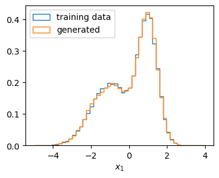

Using the MadNIS flow library
=============================

In addition to neural importance sampling, the normalizing flow implementation in the MadNIS package
can also be used for other applications. The following examples illustrate how unconditional and
conditional MadNIS flows can be trained on a toy training dataset.

Simple flow training
--------------------

As an example distribution, we will look at a two-dimensional Gaussian mixture model with two peaks
at :math:`(-1,-1)` and :math:`(1,1)` and standard deviations 1 and 0.5. We can generate our
training dataset with the code

.. code-block:: python

    import torch
    data = torch.cat((
        torch.randn((25000, 2)) - 1, 0.5 * torch.randn((25000, 2)) + 1
    ), dim=0)

Now we can build the MadNIS flow and train it on the data. In this case we will use a Gaussian
latent space. Another option would be a uniform latent space, in which case the distribution would
be restricted to the unit hypercube. As a loss function, we use the negative log-likelihood.

.. code-block:: python

    from madnis.nn import Flow
    from torch.utils.data import TensorDataset, DataLoader

    loader = DataLoader(TensorDataset(data), batch_size=1000, shuffle=True)
    flow = Flow(dims_in=2, uniform_latent=False)
    optimizer = torch.optim.Adam(flow.parameters(), lr=3e-4)

    for epoch in range(20):
        epoch_losses = []
        for x, in loader:
            optimizer.zero_grad()
            loss = -flow.log_prob(x).mean()
            loss.backward()
            optimizer.step()
            epoch_losses.append(loss.item())
        print(f"Epoch {epoch+1}: loss={sum(epoch_losses) / len(loader)}")

In the last step, we can draw samples from our learned distribution and confirm that the
normalizing flow has indeed learned the distribution of the training data by making histograms.

.. code-block:: python

    import matplotlib.pyplot as plt
    import numpy as np

    with torch.no_grad():
        samples = flow.sample(50000)
    bins = np.linspace(-5, 4, 50)
    plt.hist(data[:,0], bins=bins, histtype="step", label="training data", density=True)
    plt.hist(samples[:,0], bins=bins, histtype="step", label="generated", density=True)
    plt.xlabel("$x_1$")
    plt.legend()

   Histogram over samples generated by the trained normalizing flow and its training samples.

Conditional flow training
-------------------------

MadNIS flows can also be used to learn conditional distributions. We again use the Gaussian mixture
model from the previous section to obtain points :math:`x`, but apply a Gaussian smearing with
standard deviation 0.5 as a second step, giving us pairs of points :math:`(x, y)`. We can now use conditional flows to, for example, solve the inverse problem, i.e. learn the distribution
:math:`p(x|y)`. This can be done by passing a ``dims_c`` argument to the flow constructor and a
``c`` argument to the ``log_prob`` method.

.. code-block:: python

    data_x = torch.cat((
        torch.randn((25000, 2)) - 1, 0.5 * torch.randn((25000, 2)) + 1
    ), dim=0)
    data_y = data_x + 0.5 * torch.randn((50000, 2))

    loader = DataLoader(TensorDataset(data_x, data_y), batch_size=1000, shuffle=True)
    flow = Flow(dims_in=2, dims_c=2, uniform_latent=False)
    optimizer = torch.optim.Adam(flow.parameters(), lr=3e-4)

    for epoch in range(30):
        epoch_losses = []
        for x, y in loader:
            optimizer.zero_grad()
            loss = -flow.log_prob(x, c=y).mean()
            loss.backward()
            optimizer.step()
            epoch_losses.append(loss.item())
        print(f"Epoch {epoch+1}: loss={sum(epoch_losses) / len(loader)}")

Once the flow is trained, we can again use it to draw samples and plot histograms. For example, we
can check if we recover the distribution :math:`p(x)` by sampling from :math:`p(x|y)` for
:math:`y \sim p(y)` and look at the distribution :math:`p(x|y^{(i)})` for individual points
:math:`y^{(i)}`.

.. code-block:: python

    with torch.no_grad():
        samples_x = flow.sample(c=data_y)
        samples_x0 = flow.sample(c=data_y[0:1,:].expand(10000,2))
        samples_x1 = flow.sample(c=data_y[1:2,:].expand(10000,2))
    bins = np.linspace(-5, 4, 50)
    plt.hist(samples_x[:,0], bins=bins, histtype="step", label="$p(x)$", density=True)
    plt.hist(samples_x0[:,0], bins=bins, histtype="step", label="$p(x|y^{(0)})$", density=True)
    plt.hist(samples_x1[:,0], bins=bins, histtype="step", label="$p(x|y^{(1)})$", density=True)
    plt.xlabel("$x_1$")
    plt.legend()

   Histogram over samples generated by the trained conditional normalizing flow.

Hyperparameters
---------------

There are several hyperparameter that can be passed as arguments to the constructor of the
:py:class:`Flow <madnis.nn.Flow>` class. The parameters ``permutations`` and ``blocks`` can be used
to control how the coupling blocks are constructed, and which dimensions are transformed conditioned
on the other dimensions. The default choice ``permutaions="log"`` ensures that every dimension is
conditioned on ecery other dimension at least once, and the number of coupling blocks is chosen
automatically. Other options include ``random`` and ``exchange``. In these cases, the number of
coupling blocks has to be specified. For the most fine-grained control, a boolean tensor can be
passed using the ``condition_mask`` argument to control which dimensions are used as condition for
every coupling block.

The arguments ``layers``, ``units`` and ``activaton`` can be used to change the size of the flow
sub-networks. The defaults for the subnet size are relatively small, so making the number of
layers and units larger can often lead to improvements. Alternatively, custom sub-networks can be
constructed by passing a function to the ``subnet_constructor`` argument. The arguments ``bins``,
``spline_bounds``, ``min_bin_width``, ``min_bin_height`` and ``min_bin_derivative`` determine the
hyperparameters of the rational quadratic spline transformation that is the core of the normalizing
flows used in MadNIS.

The argument ``channels`` can be used to specify the number of channels and build a
multi-channel flow, i.e. multiple independent flows that share the same architecture and can
therefore be efficiently evaluated in parallel in parallel. In this cases, the ``channel``
argument has to be given when the methods :py:meth:`sample <madnis.nn.Flow.sample>`,
:py:meth:`prob <madnis.nn.Flow.prob>`, :py:meth:`log_prob <madnis.nn.Flow.log_prob>` or
:py:meth:`transform <madnis.nn.Flow.transform>` are called. Lastly, the ``mapping`` argument
allows to add an additional transformation (or one tranformation per channel in the
multi-channel case). For example, this can be used to add preprocessing steps as part of the
normalizing flow.
