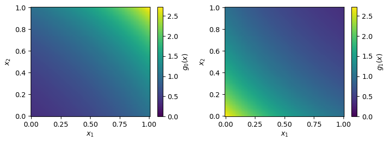

Multi-channel integration
=========================

Sometimes, a good mapping that maps out all features of an integrand may be hard to find. In this
case, we can use multi-channel integration, where different channels focus on different parts of the
integrand. This also enables us to incorporate prior knownledge about our integrand.

Toy multi-channel integrand
---------------------------

As a toy example, we will look at a two-dimensional function with a positive and a negative
Gaussian peak,

.. math::
    f(x) = \exp\left(-\frac{\sum_{i=1,2}\left(x_i - \frac{1}{2} + d\right)^2}{2\sigma^2}\right)
    - \exp\left(-\frac{\sum_{i=1,2}\left(x_i - \frac{1}{2} - d\right)^2}{2\sigma^2}\right)

with :math:`d = 0.3` and :math:`\sigma = 0.2`. The integral of this function over :math:`[0,1]^2`
is 0.

    Toy integrand for multi-channel integration

MadNIS splits up the integrand into channels by multiplying it with a channel weight
:math:`\alpha_i(x)` that is normalized over all channels

.. math::
    \sum_i \alpha_i(x) = 1 \; .

An individual normalizing flow is trained for each of the channels. The channel weights are also
computed using a neural network that is trained simultaneously with the flows.

Multi-channel training can be enabled in MadNIS by constructing the integrand using the
:py:class:`Integrand <madnis.integrator.Integrand>` class.

.. code-block:: python

    import torch
    from madnis.integrator import Integrator, Integrand

    def integrand_func(x, channel):
        dist = 0.3
        sigma = 0.2
        return (
            torch.exp(-(x - 0.5 + dist).square().sum(dim=-1) / (2 * sigma**2))
            - torch.exp(-(x - 0.5 - dist).square().sum(dim=-1) / (2 * sigma**2))
        )

    integrand = Integrand(integrand_func, input_dim=2, channel_count=2)
    integrator = Integrator(integrand)
    def callback(status):
        if (status.step + 1) % 200 == 0:
            print(f"Batch {status.step + 1}: loss={status.loss:.5f}")
    integrator.train(2000, callback=callback)
    result, error = integrator.integral()
    print(f"Integration result: {result:.5f} +- {error:.5f}")

We set the number of channels to two and enable the training of the channel weights, but do not
specify any other information on how to construct the channels. Hence, both start out with a flat
mapping and the channel weights are constant over the whole integration domain. The training is then
performed as in the single-channel case. The output is

.. code-block:: text

    Batch 200: loss=1.00819
    Batch 400: loss=0.06211
    Batch 600: loss=0.02013
    Batch 800: loss=0.01269
    Batch 1000: loss=0.02129
    Batch 1200: loss=0.00203
    Batch 1400: loss=0.00886
    Batch 1600: loss=0.01239
    Batch 1800: loss=0.01142
    Batch 2000: loss=0.00934
    Integration result: -0.00028 +- 0.00024

We can see that we get the correct result within the integration uncertainty. To better understand
what the networks have learned, we can plot histograms over the generated samples in each of the two
channels and the learned channel weights.

.. code-block:: python

    import matplotlib.pyplot as plt
    samples = integrator.sample(100000)
    mask = samples.channels == 0

    plt.hist2d(samples.x[mask,0], samples.x[mask,1], bins=30)
    plt.show()

    plt.hist2d(samples.x[~mask,0], samples.x[~mask,1], bins=30)
    plt.show()

    plt.scatter(
        samples.x[:,0], samples.x[:,1], c=samples.alphas[:,0], marker=".", vmin=0, vmax=1
    )
    plt.xlim(0,1)
    plt.ylim(0,1)
    plt.colorbar()
    plt.show()

We can see that each channel only focuses on a single peak of the distribution and the channel
weights split the integration domain into two parts.

    Histograms of the two different learned channel mappings and learned channel weights.

Adding mappings and prior channel weights
-----------------------------------------

While for simple toy examples, MadNIS is able to find sensible decompositions of the integration
space into channels, this is usually not easily possible for more complex and high-dimensional
integrands. In these cases, prior knowledge about the integrand has to be used to construct the
channel mappings and weights. In our toy example, we can construct two mappings such that each one
maps more points in one half of the integration space,

.. math::
    y = \text{sigmoid}\left(\text{logit}(x) \pm \frac{1}{2}\right) \; .

This mapping is invertible and its Jacobian is given by

.. math::
    \frac{\partial y}{\partial x} = \frac{y(1-y)}{x(1-x)} \; .

The following figure visualizes the resulting probability distributions.

    Probability distributions for the analytic channel mappings.

Furthermore, we can specify channel weights that are used as a starting point instead of the uniform
initialization from the previous example. One way to define such channel weights is to define them
as the probability distribution given by the different channel mappings and normalized in each
point. Another way is to define them using parts of the integrand itself. We can rewrite our
integrand as

.. math::
    f(x) = f_0(x) - f_1(x)
    \quad\text{with}\quad
    f_{0,1}(x) = \exp\left(-\frac{\sum_{i=1,2}\left(x_i - \frac{1}{2} \pm d\right)^2}{2\sigma^2}\right)

and then use this to define the channel weights as

.. math::
    \alpha_{0,1} = \frac{f_i(x)}{f_0(x) + f_1(x)} \; .

These mappings and channel weights have to be computed as part of the call to the integrand. Again,
this can be done using the :py:class:`Integrand <madnis.integrator.Integrand>` class.

.. code-block:: python

    def integrand_func(x, channel):
        y = torch.sigmoid(torch.logit(x) + channel[:,None] - 0.5)
        jac = torch.prod(y*(1-y) / (x * (1-x)), dim=-1)
        dist = 0.3
        sigma = 0.2
        f_0 = torch.exp(-(y - 0.5 + dist).square().sum(dim=-1) / (2 * sigma**2))
        f_1 = torch.exp(-(y - 0.5 - dist).square().sum(dim=-1) / (2 * sigma**2))
        f = f_0 - f_1
        alpha = torch.stack([f_0, f_1], dim=-1) / (f_0 + f_1)[:, None]
        return f * jac, y, alpha

    integrand = Integrand(
        integrand_func,
        input_dim=2,
        channel_count=2,
        remapped_dim=2,
        has_channel_weight_prior=True,
    )
    integrator = Integrator(integrand)

    def callback(status):
        if (status.step + 1) % 100 == 0:
            print(f"Batch {status.step + 1}: loss={status.loss:.5f}")
    integrator.train(2000, callback=callback)
    result, error = integrator.integral()
    print(f"Integration result: {result:.5f} +- {error:.5f}")

The dimension of the remapped points :math:`y` could be larger than that of the integration space.
Therefore, we have to specify their dimension using the ``remapped_dim`` parameter. In addition, we
set the parameter ``has_channel_weight_prior`` to ``True``. The second input to ``integrand_func``
contains the index of the channels that each sample is in. The function returns the integrand value
multiplied with the Jacobian from the mapping, the remapped point and the channel weights. After
the training, we can again take a look at the learned channel mappings and weights using the
plotting code from above. (Note that this time we have to plot ``samples.y`` instead of
``samples.x`` to access the remapped points.)

    Histograms of the two different learned channel mappings and learned channel weights
    for a training with analytical channel mappings and prior channel weights.

Like before, every channel has learned to map out one peak of the integrands and the channel weights
nicely separate the integration space into two halves. Note that if good prior weights are provided,
it might be sufficient to just train the normalizing flows and disable the channel weight training
by setting the ``train_channel_weights`` option to ``False``, but even then, training the channel
weights often leads to further improvements.

Symmetries between channels
---------------------------

Sometimes our integrand has symmetries that we want to make use of. In the example above, we have

.. math::
    f(1 - x) = -f(x) \; ,

or in other words, the two peaks have the same shape and only differ in their sign. Therefore, the
channel mappings used to map out these peaks can be shared between the two channels that we
construct. At the same time, every channel still needs its own channel weight. In MadNIS, this can
be achieved using the  :py:class:`ChannelGrouping <madnis.integrator.ChannelGrouping>` class. We
have to slightly modify the implementation of the channel mappings compared to the code above such
that we can turn one channel into the other with the simple transformation :math:`y \to 1 - y`.

.. code-block:: python

    from madnis.integrator import ChannelGrouping

    def integrand_func(x, channel):
        y_0 = torch.sigmoid(torch.logit(x) - 0.5)
        y = torch.where(channel[:,None] == 1, 1 - y_0, y_0)
        jac = torch.prod(y*(1-y) / (x * (1-x)), dim=-1)
        dist = 0.3
        sigma = 0.2
        f_0 = torch.exp(-(y - 0.5 + dist).square().sum(dim=-1) / (2 * sigma**2))
        f_1 = torch.exp(-(y - 0.5 - dist).square().sum(dim=-1) / (2 * sigma**2))
        f = f_0 - f_1
        alpha = torch.stack([f_0, f_1], dim=-1) / (f_0 + f_1)[:, None]
        return f * jac, y, alpha

    integrand = Integrand(
        integrand_func,
        input_dim=2,
        channel_count=2,
        remapped_dim=2,
        has_channel_weight_prior=True,
        channel_grouping=ChannelGrouping([None, 0]),
    )
    integrator = Integrator(integrand)

The training code does not change. The arguments ``[None, 0]`` to the
:py:class:`ChannelGrouping <madnis.integrator.ChannelGrouping>` constructor mean that a regular
channel is constructed at index 0 whereas the channel at index 1 reuses the learned mapping of the
channel at index 0. Overall, the behavior of the training is similar to that of the previous
training without the symmetry. The network again learns a sharped boundary between the two channels
in the middle of the integration space. However this time, only a single normalizing flow has to be
optimized.

Additionally, the constructor of the :py:class:`Integrator <madnis.integrator.Integrator>` class
also has an argument ``group_channels_in_loss``. This also groups channels in the computation of the
stratified variance loss, resulting in better numerical stability for trainings with a large number
of channels. However, it also prevents the optimization of the relative channels weights within a
group of channels.

Stratified training
-------------------

By default, the training samples are distributed uniformly among the channels during the training.
If stratified training is enabled, more samples are generated for channels with higher variance.
This allows the training to focus on the most important channels. It can be enabled using the
``uniform_channel_ratio`` argument of the :py:class:`Integrator <madnis.integrator.Integrator>` class.
It specifies the ratio of samples that are distributed uniformly among channels. The rest is
distributed proportional to the standard deviation of the channel (stratified sampling). Setting
this parameter to zero can lead to unstable trainings. Values like 0.1 tend to work well in most
situations. The training always starts with a warmup phase (depending on the
``integration_history_length``) where the channel is sampled uniformly.

Channel dropping
----------------

For trainings with many channels, we often observe that MadNIS reduces the contribution of some
channels such that it is close to zero. In this case, it can be useful to disable these channels
entirely. To this end, the :py:class:`Integrator <madnis.integrator.Integrator>` class has the
options ``channel_dropping_threshold`` and ``channel_dropping_interval``. The latter specifies the
number of training iterations between checks for channels that can be dropped. The former is a number
between 0 and 1. All channels with a combined relative contribution to the total integral that is
below this threshold are dropped. If a callback function is used to monitor the training progress,
the number of channels that were dropped after a training iteration can be found in the
``dropped_channels`` field of the :py:class:`TrainingStatus <madnis.integrator.TrainingStatus>`
object passed to the callback function.

Limiting memory usage of buffered training
------------------------------------------

For buffered training, MadNIS has to store the prior channel weights returned by the integrand. In
cases with very many channels, this can require a lot of memory. Since in such cases, the
contribution of most channels at a given point will be close to 0, the memory usage can be reduced
by only buffering the channel weights of channels with large contributions. The parameter
``max_stored_channel_weights`` of the :py:class:`Integrator <madnis.integrator.Integrator>` class
specifies the number of stored channel weights. Note that if this option is enabled, both the
weights and indices of the channels have to be stored, so the amount of memory used is
``2 * buffer_capacity * max_stored_channel_weights * 8`` in double precision mode.
